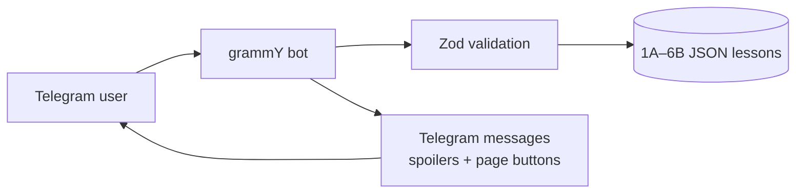

<div align="center">


# 서울대 한국어 · O‘zbekcha

**Koreys tilini o‘zbekcha, bosqichma-bosqich o‘rganing.**

A lightweight Telegram study companion for the Seoul Korean 1A–6B sequence: vocabulary, clear grammar explanations, original dialogues and a continuing story.

### [▶ Open the bot on Telegram](https://t.me/souldehangugobot)


**12 books** · **133 learning units** · **1,942 vocabulary entries** · **442 grammar modules** · **267 original dialogues**

</div>

## See the bot

<p align="center">
  
</p>

| Choose a book | Browse its lessons |
|:---:|:---:|
|  |  |

| Open a lesson | Study the grammar |
|:---:|:---:|
|  |  |

<details>
<summary>First-launch welcome screen</summary>
<br>

</details>

These are real Telegram screenshots with only the empty margins and app sidebar cropped away. The bot's display language is Uzbek; Korean examples retain their original script.

## What the bot does

- **Book → lesson → section:** choose any book from 1A to 6B, then open vocabulary, grammar, dialogues or the story.
- **Learn, then reveal:** Uzbek translations of examples and dialogues are hidden behind Telegram spoilers.
- **Read comfortably:** long sections are split into Telegram-sized pages with previous/next controls.
- **Keep the thread:** the original story follows the same characters across lessons; Hangul has its own beginner section in 1A.
- **Stay lightweight:** lessons are prepared JSON files. The running bot does not call an AI model, process PDFs or need a database.



## Learning content

| Level | Books | Focus |
|:---:|:---:|---|
| 1 | [1A](1A-mazmun.md) · [1B](1B-mazmun.md) | Hangul, introductions and everyday basics |
| 2 | [2A](2A-mazmun.md) · [2B](2B-mazmun.md) | Daily situations and longer sentences |
| 3 | [3A](3A-mazmun.md) · [3B](3B-mazmun.md) | Explaining experiences and opinions |
| 4 | [4A](4A-mazmun.md) · [4B](4B-mazmun.md) | Abstract topics and nuanced grammar |
| 5 | [5A](5A-mazmun.md) · [5B](5B-mazmun.md) | Media, society, literature and analysis |
| 6 | [6A](6A-mazmun.md) · [6B](6B-mazmun.md) | Advanced discussion, culture and social issues |

Each unit contains themed words with pronunciation and Uzbek meaning, grammar patterns with formation rules and common mistakes, two short dialogues, and a story scene. The `*-mazmun.md` files above are readable exports; `data/*.json` is what the bot loads. The [content review notes](CONTENT_REVIEW.md) and matching `CONTENT_REVIEW_*.md` files record source coverage and editorial notes.

**Content boundary:** lesson themes, vocabulary topics and grammar patterns follow the supplied *Seoul Korean Student's Books*. Uzbek explanations, translations, examples, dialogues and stories were written for this project. Textbook pages and dialogues are not bundled. This is an adapted study companion, not a copy of the books or every workbook exercise.

## Try it locally

Requirements: Node.js **20+** (22 recommended) and a Telegram bot token from BotFather.

```bash
git clone https://github.com/khodiboev/souldehangugobot.git
cd souldehangugobot
npm ci
cp .env.example .env
# Put your BOT_TOKEN in .env; never commit or paste it into a chat.
npm run check
npm test
npm run dev
```

Send `/start` to your bot. `/books` opens the book list and `/help` explains the controls. Only **one polling instance** may use a token at a time. `npm run dev` runs in the foreground: closing the terminal stops it.

For compiled execution:

```bash
npm run build
npm start
```

## Run in the background

The repository includes a Dockerfile and Compose configuration. On a machine with Docker running, put `BOT_TOKEN` in `.env`, then run:

```bash
docker compose up -d --build
docker compose logs --tail=30
```

Compose uses `restart: unless-stopped`; the container is separate from the terminal. A Mac-hosted bot still stops when the Mac sleeps or shuts down. For 24/7 availability, run it on an always-on server. This repository is **not itself a hosting service**, and the Compose deployment has not been performed here.

After changing a lesson JSON file, restart the running bot. Do not run the local process and the container with the same token simultaneously.

## Project structure

```text
src/             Telegram handlers, keyboards, rendering and content validation
data/            Prepared JSON lessons for 1A–6B
tests/           Pagination, safety, navigation and content checks
*-mazmun.md      Human-readable lesson exports
CONTENT_REVIEW*   Curriculum coverage and editorial notes
Dockerfile        Multi-stage Node 22 image
```

`npm run check` validates all lesson JSON files, message lengths and callback data. `npm test` covers Unicode-safe pagination, HTML escaping, navigation and lesson structure. `npm run build` type-checks the TypeScript app. The bot uses long polling, so it needs no webhook or domain.

## Credentials and contributions

`.env`, dependencies and compiled output are ignored by Git. The bot token remains local and is never needed to review the content. If you spot a Korean or Uzbek wording issue, open an issue with the book, lesson number and suggested correction.

Built with [grammY](https://grammy.dev/) and the [Telegram Bot API](https://core.telegram.org/bots/api).
