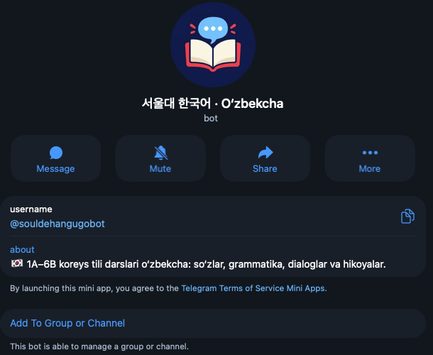
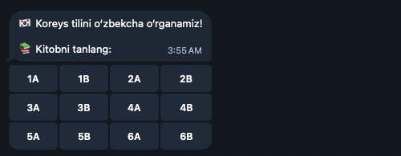
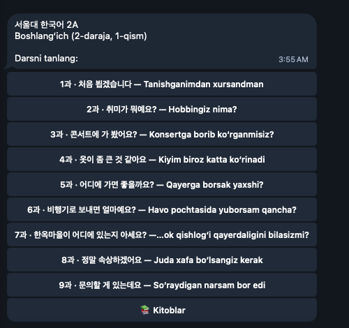
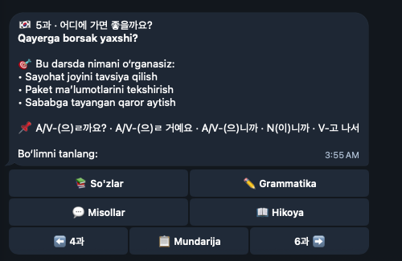
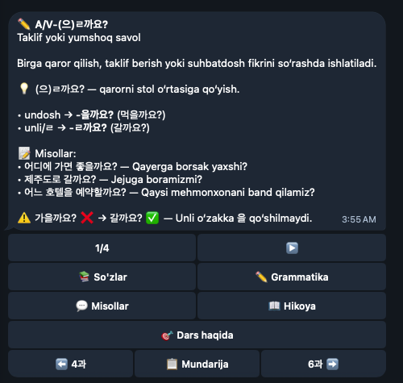
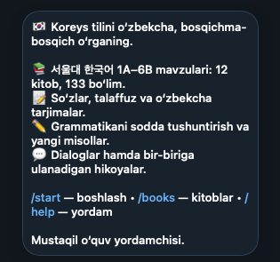
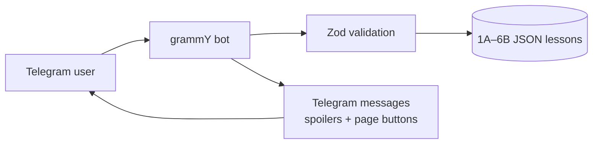

<div align="center">


# 서울대 한국어 · O‘zbekcha

**Koreys tilini o‘zbekcha, bosqichma-bosqich o‘rganing.**

A lightweight Telegram study companion for the Seoul Korean 1A–6B sequence: vocabulary, clear grammar explanations, original dialogues and a continuing story.

### [▶ Open the bot on Telegram](https://t.me/souldehangugobot)


**12 books** · **133 learning units** · **2,310 lesson quiz questions** · **24-question placement test**

</div>

## See the bot

<p align="center">
  
</p>

<p align="center">
  <strong>1 · Choose one of 12 books</strong><br>
  
</p>

<p align="center">
  <strong>2 · Browse lessons in Korean and Uzbek</strong><br>
  
</p>

<p align="center">
  <strong>3 · Pick words, grammar, dialogues or the story</strong><br>
  
</p>

<p align="center">
  <strong>4 · Study clear explanations and examples</strong><br>
  
</p>

<details>
<summary>First-launch welcome screen</summary>
<br>

</details>

These are real Telegram screenshots with only the empty margins and app sidebar cropped away. The bot's display language is Uzbek; Korean examples retain their original script.

## What the bot does

- **Book → lesson → section:** choose any book from 1A to 6B, then open vocabulary, grammar, dialogues or the story.
- **Learn, then reveal:** Uzbek translations of examples and dialogues are hidden behind Telegram spoilers.
- **Read comfortably:** long sections are split into Telegram-sized pages with previous/next controls.
- **Keep the thread:** the original story follows the same characters across lessons; Hangul has its own beginner section in 1A.
- **Practice after every lesson:** all 133 units have quizzes with explanations, saved results and mistake review. Question counts rise with the level: 10, 15 or 20.
- **Find a starting point:** an optional 24-question test in `/start` suggests a book from 1A to 6B. It is a rough guide, not a formal proficiency assessment.
- **Keep the study chat tidy:** unsupported text, photos, audio and files sent to the bot's private chat are deleted when Telegram permits it. The bot shows a short usage reminder at most once per minute. Ordinary group messages are left alone.
- **Stay lightweight:** lessons are prepared JSON files. The running bot does not call an AI model, process PDFs or need a database.
- **See basic usage:** the owner can see unique private-chat users and recent activity with `/stats` after setting `ADMIN_USER_ID`.



## Learning content

| Level | Books | Focus |
|:---:|:---:|---|
| 1 | [1A](docs/COURSE_CONTENT.md#book-1a) · [1B](docs/COURSE_CONTENT.md#book-1b) | Hangul, introductions and everyday basics |
| 2 | [2A](docs/COURSE_CONTENT.md#book-2a) · [2B](docs/COURSE_CONTENT.md#book-2b) | Daily situations and longer sentences |
| 3 | [3A](docs/COURSE_CONTENT.md#book-3a) · [3B](docs/COURSE_CONTENT.md#book-3b) | Explaining experiences and opinions |
| 4 | [4A](docs/COURSE_CONTENT.md#book-4a) · [4B](docs/COURSE_CONTENT.md#book-4b) | Abstract topics and nuanced grammar |
| 5 | [5A](docs/COURSE_CONTENT.md#book-5a) · [5B](docs/COURSE_CONTENT.md#book-5b) | Media, society, literature and analysis |
| 6 | [6A](docs/COURSE_CONTENT.md#book-6a) · [6B](docs/COURSE_CONTENT.md#book-6b) | Advanced discussion, culture and social issues |

Each unit contains themed words with pronunciation and Uzbek meaning, grammar patterns with formation rules and common mistakes, two short dialogues, and a story scene. The linked sections in [the combined course document](docs/COURSE_CONTENT.md) are readable exports with source and editorial notes; `data/*.json` is what the bot loads.

Every ready unit has a private-chat quiz under **🧠 10/15/20 savollik test**. The question mix is 4 words, 4 grammar, 2 context at level 1; 5/6/4 at levels 2–3; and 6/8/6 at levels 4–6. Each answer has an explanation and a link to the relevant lesson section. Results include the latest score, best attempt and mistake review. An unfinished attempt resumes after a restart. There are **2,310 lesson questions** in `data/quizzes/*.json`.

The **🧭 Darajani aniqlash** button on `/start` opens an optional 24-question placement test, drawing two questions from each book. Its 1A–6B suggestion is approximate; users can choose any book regardless of the result. The 1A Hangul and 1A lesson 1 quizzes were written as the original pilot. The remaining static quiz files were generated from this project's prepared lesson words, grammar examples and story lines, then sampled for review. Run `npm run quiz:generate` to create missing quiz files; use `npm run quiz:generate -- --refresh` to rebuild generated files while preserving the two pilot files. Review generated wording before publishing edits. When changing a quiz's correct answers, increment its `version` so old attempts are not scored against new questions.

**Content boundary:** lesson themes, vocabulary topics and grammar patterns follow the supplied *Seoul Korean Student's Books*. Uzbek explanations, translations, examples, dialogues and stories were written for this project. Textbook pages and dialogues are not bundled. This is an adapted study companion, not a copy of the books or every workbook exercise.

## Try it locally

Requirements: Node.js **20+** (22 recommended) and a Telegram bot token from BotFather.

```bash
git clone https://github.com/khodiboev/souldehangugobot.git
cd souldehangugobot
npm ci
cp .env.example .env
# Put your BOT_TOKEN in .env; never commit or paste it into a chat.
npm run check
npm test
npm run dev
```

Send `/start` to your bot to see the optional placement test and book list. `/books` opens the same menu, `/help` explains the controls, and `/myid` shows your Telegram numeric ID in a private chat. Put that ID in `ADMIN_USER_ID` in `.env` to enable the owner-only `/stats` command. Only **one polling instance** may use a token at a time. `npm run dev` runs in the foreground: closing the terminal stops it.

For compiled execution:

```bash
npm run build
npm start
```

## Run in the background

The repository includes a Dockerfile and Compose configuration. On a machine with Docker running, put `BOT_TOKEN` in `.env`, then run:

```bash
docker compose up -d --build
docker compose logs --tail=30
```

Compose uses `restart: unless-stopped`; the container is separate from the terminal. The production bot runs on an Ubuntu VPS, so closing the Mac terminal does not stop it. Docker's named `bot-state` volume keeps usage data and per-user quiz progress across container rebuilds. Existing progress in the earlier `state/quizzes.json` format is migrated on startup; that file remains as a backup. This does not replace server monitoring or backups.

`/stats` reports total unique users plus users active in the last 24 hours, 7 days and 30 days. Only private-chat interactions from the time tracking was enabled are counted; opening the link without starting the bot is not visible. The bot stores only Telegram numeric IDs and first/last activity times in the private state volume, not names or message text. Without `ADMIN_USER_ID`, `/stats` is unavailable to everyone. The state file is excluded from Git.

After changing a lesson JSON file, restart the running bot. Do not run the local process and the container with the same token simultaneously.

## Project structure

```text
src/             Telegram handlers, keyboards, rendering and content validation
data/            Prepared JSON lessons, quiz banks and placement selections
scripts/         Static quiz generator for missing or refreshed lesson quizzes
tests/           Pagination, safety, navigation and content checks
docs/            Combined lesson export and curriculum review notes
state/           Local usage counts and quiz progress (ignored by Git; Docker uses a named volume)
Dockerfile        Multi-stage Node 22 image
```

`npm run check` validates lesson and quiz JSON, full quiz coverage, placement selections, message lengths and callback data. `npm test` covers Unicode-safe pagination, HTML escaping, navigation, quiz progress, placement and lesson structure. `npm run build` type-checks the TypeScript app. The bot uses long polling, so it needs no webhook or domain.

## Credentials and contributions

`.env`, dependencies and compiled output are ignored by Git. The bot token remains local and is never needed to review the content. If you spot a Korean or Uzbek wording issue, open an issue with the book, lesson number and suggested correction.

Built with [grammY](https://grammy.dev/) and the [Telegram Bot API](https://core.telegram.org/bots/api).
